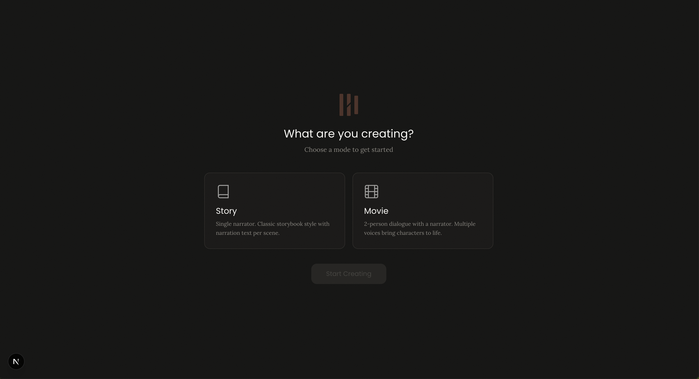
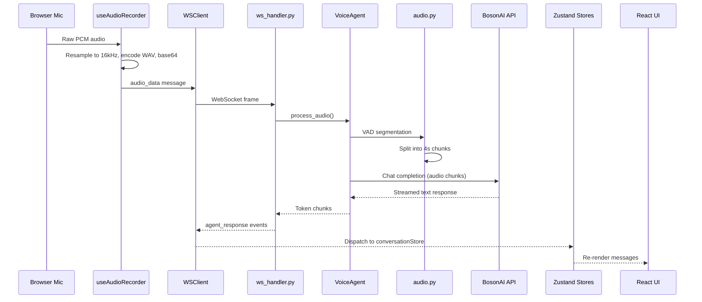
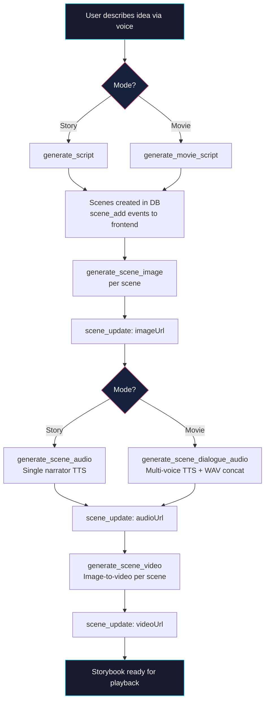
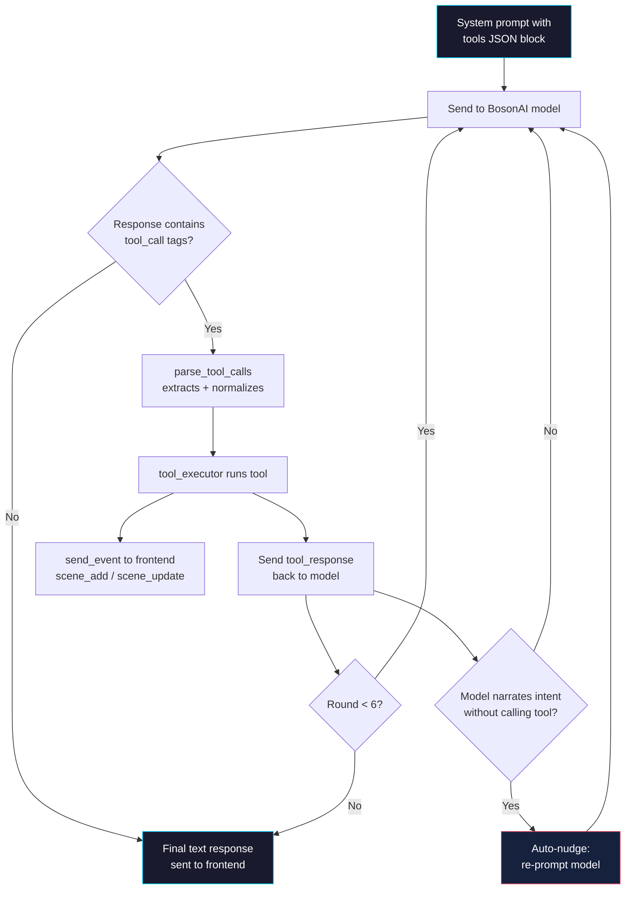

# SayCut

**An AI-powered visual audio storybook maker — create interactive storybooks just by talking.**

SayCut lets you build rich, narrated visual storybooks through natural voice conversation. Powered by BosonAI's HiggsAudioM3 voice agent, you describe your characters, plot, and style — and SayCut handles the rest: generating scripts, illustrations, narration, and video.

SayCut supports two creation modes:
- **Story mode** — Single narrator with narration text per scene, single TTS voice
- **Movie mode** — 2-person conversational scripts with dialogue lines per scene, 3 voices (Narrator via Morgan Freeman clone + 2 characters), multi-voice TTS via WAV concatenation

## Screenshots

| Projects | Editor | Mode Selection |
|----------|--------|----------------|
|  |  |  |

## How It Works

SayCut guides you through five phases, all driven by voice interaction:

### 1. Choose a Mode

Select **Story** or **Movie** mode. Movie mode lets you configure two character names and voices.

### 2. Describe Your Idea

Talk to the voice agent — describe characters, setting, tone, and art style. The agent generates a scene-by-scene script (narration text in Story mode, dialogue lines in Movie mode).

### 3. Storyboard

Key frame images are generated for each scene. Review the frames and request changes — "make the dragon bigger" or "change the background to a forest."

### 4. Production

SayCut assembles everything:
- Generates video sequences from the key frames (image-to-video)
- Produces narration audio (Story) or multi-voice dialogue audio (Movie) via TTS
- Combines visuals and audio into the final storybook

### 5. Playback & Edit

Watch your completed storybook in the cinematic player. If something isn't right, tell the agent which scene to revise and it regenerates just that part. You can also insert or remove scenes by voice.

## Tech Stack

```
┌─────────────────────────────────┐
│        Next.js Frontend         │
│  Voice Input / Storyboard UI   │
│       Video Playback            │
└──────────────┬──────────────────┘
               │ REST + WebSocket
┌──────────────▼──────────────────┐
│        FastAPI Backend          │
│   Workflow Orchestration        │
│   bosonUtil/ (audio, api, tools)│
│   Local File Storage            │
└──────────────┬──────────────────┘
               │
    ┌──────────┴──────────┐
    ▼                     ▼
┌────────────┐   ┌───────────────┐
│  BosonAI   │   │   EigenAI     │
│  Voice     │   │  Image Gen    │
│  Agent     │   │  Image Edit   │
│            │   │  Image→Video  │
│            │   │  TTS          │
│            │   │  Script LLM   │
└────────────┘   └───────────────┘
```

### Frontend

- **Next.js** (React) — Web-based storybook creation UI
- **Web Audio API / MediaRecorder** — Browser-native voice capture
- Visual storyboard editor for reviewing and reordering scene frames
- Integrated video player for final storybook playback

### Backend

- **FastAPI** (Python) — Async API server with WebSocket support for streaming
- Orchestrates the 5-phase workflow (setup, script, storyboard, production, playback)
- Reuses existing `bosonUtil/` modules for voice agent integration
- **Local filesystem** for generated assets (images, videos, audio)

### AI Models

All models are served by **BosonAI** and **EigenAI** APIs:

| Role | Model | Provider | Protocol |
|------|-------|----------|----------|
| Voice Agent (STT + tool calling) | `higgs-audio-understanding-v3.5-Hackathon` | BosonAI | OpenAI-compatible REST |
| Script Generation | `kimi-k2-5` | EigenAI | OpenAI-compatible REST |
| Image Generation | `eigen-image` | EigenAI | REST |
| Image Editing | `qwen-image-edit-2511` | EigenAI | REST, multipart upload |
| Image-to-Video | `wan2p2-i2v-14b-turbo` | EigenAI | Async REST with polling |
| Text-to-Speech | `higgs2p5` | EigenAI | WebSocket streaming |

**Key integration patterns:**
- **Image-to-video** is asynchronous — submit a job, poll for status, then download the result MP4
- **TTS** streams PCM audio chunks over WebSocket for real-time playback
- **Image editing** accepts up to 9 source images per request, enabling character consistency across scenes

## Setup

```bash
uv sync
cd frontend && npm install && cd ..
export BOSONAI_API_KEY="your-key"   # Voice agent (hackathon.boson.ai)
export EIGENAI_API_KEY="your-key"   # Image, video, TTS, script LLM (api-web.eigenai.com)
```

### Running

```bash
# Backend (FastAPI + WebSocket on port 3001)
uv run uvicorn backend.main:app --port 3001

# Frontend (Next.js on port 3000, connects to backend via WebSocket)
cd frontend && npm run dev
```

### CLI Demo

`assistant.py` is a standalone CLI demo of the voice agent (not the production entry point):

```bash
uv run python assistant.py
uv run python assistant.py --system-prompt "You are an ASR system." --no-tools
uv run python assistant.py --model higgs-audio-understanding-v3-Hackathon
```

## Architecture

### Backend (`backend/`)
- **`main.py`** — FastAPI app: `/ws` WebSocket endpoint, `/health`, REST endpoints, static asset serving
- **`ws_handler.py`** — Per-session `VoiceAgent` with mode-specific tools/prompt, `SET_PROJECT_MODE` + `LOAD_STORYBOOK` handlers
- **`ws_protocol.py`** — Client/server message type enums and JSON encode/decode
- **`voice_agent.py`** — Async `VoiceAgent`: streaming responses, conversation history, tool call loop; mode-specific system prompts (`STORY_SYSTEM_PROMPT`, `MOVIE_SYSTEM_PROMPT`)
- **`storybook_tools.py`** — Mode-specific tool sets (`STORY_TOOLS`, `MOVIE_TOOLS`) with shared image/video/edit/remove tools; async executors for script, movie script, image, audio, dialogue audio, video, edit, remove
- **`db.py`** — Async SQLite (sessions, storybooks, scenes, messages) via `aiosqlite`; supports mode, characters, and dialogue_lines fields
- **`asset_storage.py`** — Save/serve/delete generated assets (images, video, audio) on local filesystem
- **`config.py`** — Env vars, paths, port config
- **`models.py`** — Pydantic models for DB records

### Shared utilities (`bosonUtil/`)
- **`audio.py`** — Audio chunking pipeline: load, resample to 16kHz, Silero VAD segmentation, 4-second chunking, base64 WAV encoding
- **`audio_concat.py`** — WAV concatenation for multi-voice dialogue: normalizes to 24kHz/16-bit/mono, inserts silence gaps between segments
- **`api.py`** — API configuration, message building, and prediction calls against the OpenAI-compatible endpoint
- **`tools.py`** — Tool definitions, `<tool_call>` tag parsing, and safe math evaluation
- **`eigen_config.py`** — Shared EigenAI API configuration and auth
- **`eigen_script.py`** — Script generation client (kimi-k2-5, OpenAI-compatible)
- **`eigen_tts.py`** — Text-to-speech client with Morgan Freeman voice support
- **`eigen_image_gen.py`** — Image generation client
- **`eigen_image_edit.py`** — Image editing client (multipart upload)
- **`eigen_i2v.py`** — Image-to-video client (async polling)

### Frontend (`frontend/app/`)
- **`lib/types.ts`** — TypeScript types (Scene, Message, Storybook, StoryMode, DialogueLine, CharacterConfig)
- **`lib/wsClient.ts`** — `WSClient` class: WebSocket connection with auto-reconnect and `onReady` callback
- **`lib/api.ts`** — REST client: `fetchStorybooks()`, `fetchStorybook(id)`, `fetchMessages(id)`
- **`lib/editorContext.ts`** — React context to pass `storybookId` down to `useAgent`
- **`lib/stripToolCalls.ts`** — Utility to strip `<tool_call>` tags from agent text for display
- **`stores/conversationStore.ts`** — Zustand store for conversation messages with streaming and tool status tracking
- **`stores/storybookStore.ts`** — Zustand store for storybook scenes, mode, characters
- **`stores/uiStore.ts`** — Zustand store for UI state
- **`hooks/useAgent.ts`** — React hook: manages WebSocket lifecycle, dispatches server events to stores; sends `SET_PROJECT_MODE` and `LOAD_STORYBOOK` as needed
- **`hooks/useAudioRecorder.ts`** — React hook: browser mic capture → 16kHz PCM WAV → base64
- **`hooks/useAudioPlayback.ts`** — React hook for audio playback control
- **`hooks/useWaveformAnalyser.ts`** — React hook for Web Audio API waveform analysis
- **`components/Workspace.tsx`** — Main workspace layout composing AgentPanel + SceneEditor
- **`components/AgentPanel.tsx`** — Chat panel with conversation messages and tool call cards
- **`components/MessageBubble.tsx`** — Individual message bubble (user/agent)
- **`components/ToolCallCard.tsx`** — Tool execution status card with scene image thumbnails
- **`components/ModeSelector.tsx`** — Mode selection screen: Story vs Movie cards, character name/voice config for movie mode
- **`components/SceneEditor.tsx`** — Scene thumbnail grid; renders dialogue lines (movie) or narration textarea (story)
- **`components/SceneCard.tsx`** — Individual scene card in the editor grid
- **`components/SceneStrip.tsx`** — Horizontal scene thumbnail strip/timeline
- **`components/PlayerOverlay.tsx`** — Cinematic player with crossfade; stacked dialogue subtitles (movie) or narration text (story)
- **`components/VoiceOrb.tsx`** — Toggle-click voice input (tap to start/stop recording)
- **`components/VoiceWaveform.tsx`** — Real-time waveform visualization
- **`components/SayCutLogo.tsx`** — Reusable logo (size: sm/md/lg/xl, variant: full/mark/wordmark)
- **`components/StatusPill.tsx`** — Agent status indicator pill
- **`components/ActivityLog.tsx`** — Activity log display
- **`components/ProjectCard.tsx`** — Card for projects listing: thumbnail, title, scene count, date

### CLI demo
- **`assistant.py`** — Standalone CLI demo of the voice agent (not the production entry point)

## Data Flows

### Voice Interaction Flow

Real-time voice data path from browser microphone to AI response:



### Storybook Creation Flow

Tool call chain for generating a complete storybook (Story and Movie modes):



### Tool Use Loop

The v3.5 tool calling protocol between the voice agent and BosonAI:



## Tests

```bash
# Unit tests (no API key needed)
uv run pytest tests/ -m "not integration" -v

# Integration tests (requires BOSONAI_API_KEY)
uv run pytest tests/ -m integration -v
```
