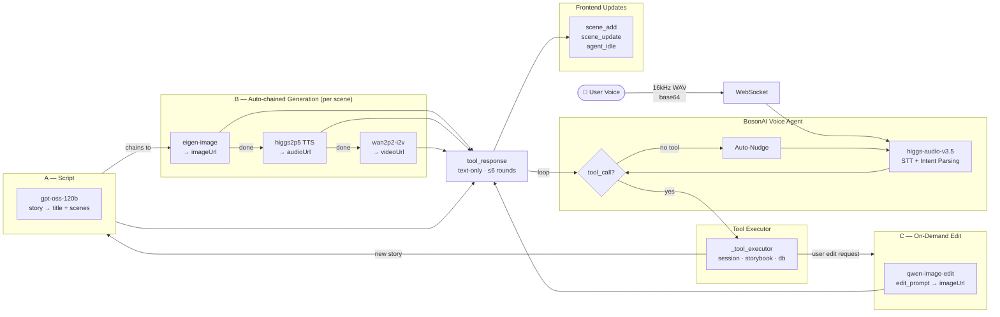

## Workflow: Boson AI + Tool-calling

```mermaid
flowchart LR
    U([🎤 User Voice]) -->|16kHz WAV\nbase64| WS[WebSocket]

    WS --> BA

    subgraph L2["BosonAI Voice Agent"]
        BA[higgs-audio-v3.5\nSTT + Intent Parsing] --> PT{tool_call?}
        PT -->|no tool| NU[Auto-Nudge] --> BA
    end

    PT -->|yes| TE

    subgraph L3["Tool Executor"]
        TE[_tool_executor\nsession · storybook · db]
    end

    TE -->|new story| TA
    TE -->|user edit request| TC

    subgraph TA["A — Script"]
        A1[gpt-oss-120b\nstory → title + scenes]
    end

    subgraph TB["B — Auto-chained Generation (per scene)"]
        B1[eigen-image\n→ imageUrl] -->|done| B2[higgs2p5 TTS\n→ audioUrl] -->|done| B3[wan2p2-i2v\n→ videoUrl]
    end

    subgraph TC["C — On-Demand Edit"]
        C1[qwen-image-edit\nedit_prompt → imageUrl]
    end

    TA -->|chains to| B1
    TA & B1 & B2 & B3 & C1 --> TR

    TR[tool_response\ntext-only · ≤6 rounds] -->|loop| PT

    TR --> FE

    subgraph L5["Frontend Updates"]
        FE[scene_add\nscene_update\nagent_idle]
    end
```